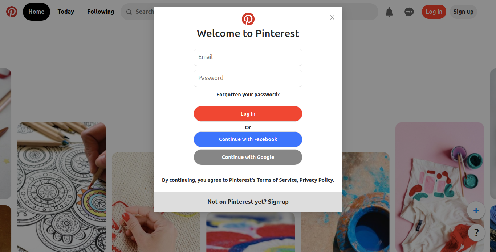
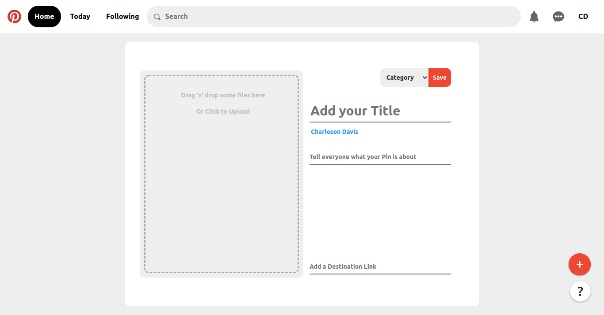
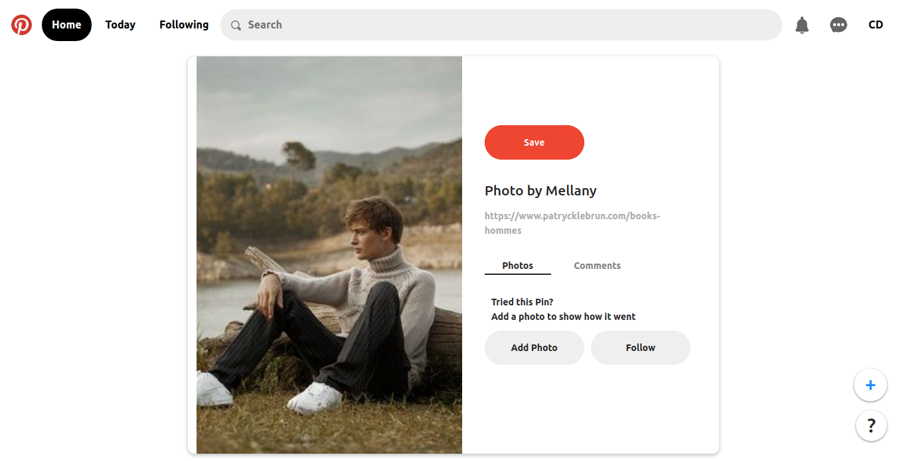

# Pinterest-clone

  <h4>
In the project directory, tried to clone Pinterest.com.  
Pinterest is an American image sharing and social media service designed to enable saving and discovery of information on the internet using images and, on a smaller scale, animated GIFs and videos, in the form of pinboards
  </h4>

## Tech Stack used:

<code></code>
<code></code>
<code></code>
<code></code>
<code></code>

## Installation and Setup Instruction
#### Run the following commands in your terminal

`git clone https://github.com/amal-biju/Pinterest-clone.git`

`json-server --watch db.json --port 3004`

`cd pinterest-clone-app`

`npm install`

`npm start`

## Libraries installed

- Ant Design
- React Dropzone
- Axios
- React router dom
- Styled components

## Login Page

## Home Page

## Add photo page

## Photo details page

## Sneak peek

